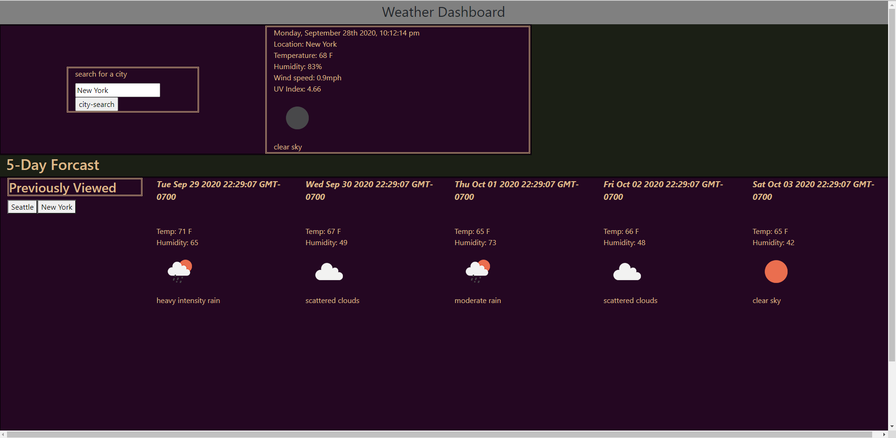

`````````````````Weather Forcaster by Evan Kirkland``````````````

This application is intended to be able to give the current weather information and weather conditions for 5 days into the future. 

When a city is entered into the submit field, the data will be sent through the openweather API.

Then this data will be displayed on the screen and the city choice will be logged for future reference. 

Once the city has been logged, it can be clicked to re-summon previous weather searches that will also be updated to current weather and display the next 5 days of weather. 

Each query of weather status will be accompanied by an image depicting the weather for that day and a description clarifying what the image represents. 

